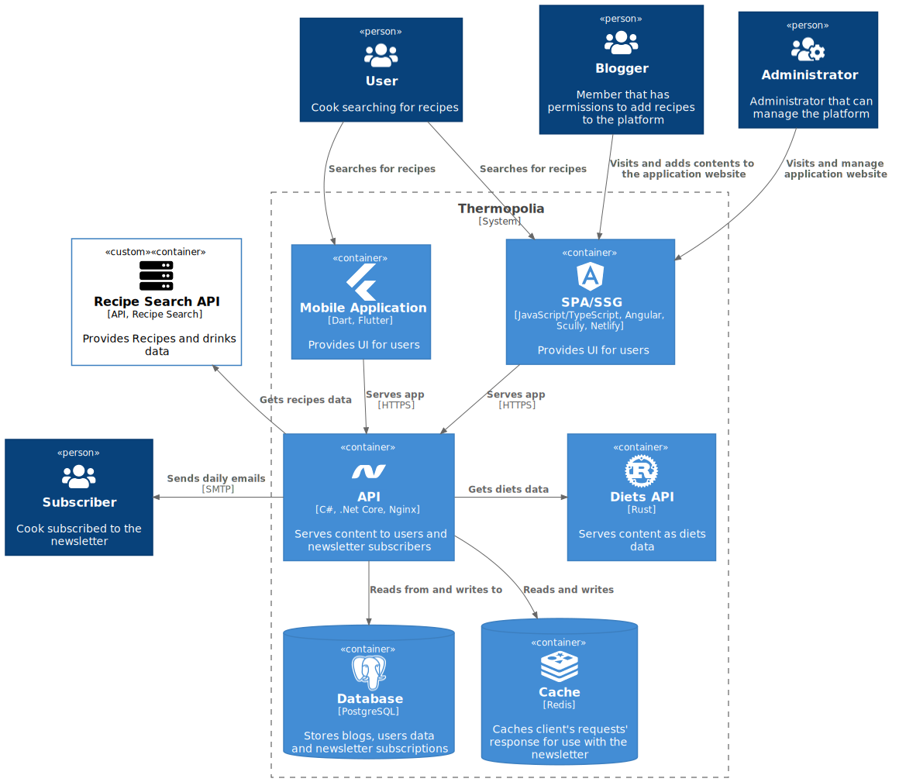

<h1 align="center">The Thermopolia API</h1>

<h4 align="center">An API for the Thermopolia App, a daily recipe recommendation and newsletter application.</h4>

<p align="center">
  <a href="#etymology">Etymology</a> •
  <a href="#key-features">Key Features</a> •
  <a href="#api">API</a> •
  <a href="#architecture-diagram">Architecture Diagram</a> •
  <a href="#how-to-use">How to use</a> •
  <a href="#built-with">Built with</a> •
  <a href="#license">License</a>
</p>

## Ethymology

Thermopolia (plural of thermopolium) was the ancient Roman/Greek equivanlt to restaurants. It was a commercial establishment for purshasing ready-to-eat food and often with servings similar to modern fast food. This name is a good description to what the application offers from easy-to-prepare recipes, newsletter subscriptions and delivery and other amazing features

## Key Features

The principal key features to keep note of are:

- Daily newsletter
- Weekly same ingredient recipes/drinks
- Week-ends recipes/drinks from a cuisine
- New recipes/drinks/diet each day
- Membres recipes/drinks articles

## API

| Method | URL                                        | Description                                     |
| ------ | ------------------------------------------ | ----------------------------------------------- |
| GET    | /Recipes/foods                             | List ten random recipes                         |
| GET    | /Recipes/foods/:id                         | Recipe by its id                                |
| GET    | /Recipes/drinks                            | List then random drinks                         |
| GET    | /Recipes/drinks/:id                        | Drink by its id                                 |
| GET    | /Recipes/diet                              | Diet randomly                                   |
| POST   | /Newsletters/subscribers                   | Subscribe to the newsletter                     |
| GET    | /Newsletters/subscribers                   | Subscribe to the newsletter                     |
| GET    | /Newsletters/subscribers/:id               | Subscriber by id                                |
| GET    | /Newsletters/subscribers/validation/:token | Confirm email by unique token of the subscriber |

## Architecture Diagram

  
C4 Model Diagram

## How to use

### Requirements

This project is built using [Visual Studio Code](https://code.visualstudio.com/), the [Omnisharp](https://code.visualstudio.com/) extension, the [.Net 6.0](https://code.visualstudio.com/) with both the SDK and the Runtime, [Docker](https://www.docker.com/) and [Docker Compose](https://docs.docker.com/compose/install/).

### Developing
Rename `example.appsettings.Development.json` into `appsettings.Development.json` and add your environment variables.
```bash
dotnet restore

dotnet ef database update # if it's not installed, you can install it with `dotnet tool install --global dotnet-ef`

docker-compose up -d # PostgreSQL, pgAdmin and Redis

dotnet run
```

### Deploying
Rename `.env.example` into `.env` and add your environment variables.
```bash
docker-compose -f docker-compose.prod.yml up -d --build --force-recreate
```

## Built with

- [.Net 6.0](https://dotnet.microsoft.com/en-us/)
- [Docker](https://www.docker.com/)
- [PostgreSQL](https://www.google.com/search?client=firefox-b-d&q=postgresql)
- [Redis](https://redis.io/)
- [Entity Framework Core](https://docs.microsoft.com/en-us/ef/core/)
- [FluentEmail](https://github.com/lukencode/FluentEmail)
- [Hangfire](https://www.hangfire.io/)
- [Recipe Search API](https://developer.edamam.com/edamam-recipe-api)
- [Swagger](https://developer.edamam.com/edamam-recipe-api)

## License

This project is under the [MIT](https://github.com/AmineAML/thermopolia-api/blob/main/LICENSE) license.